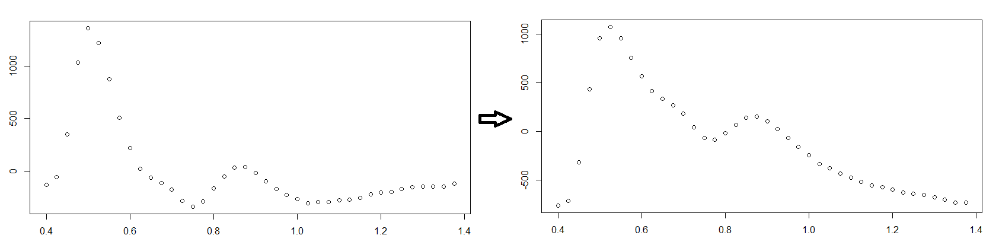
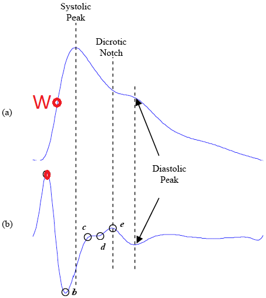

```{r setup, include=FALSE}
knitr::opts_chunk$set(echo = TRUE)
```

## PPG Model 2

This is a ReadMe for the photopletysmography (PPG) analysis published in []. It is supposed to both provide an overview of the workings fo the code, any issues we encountered and some further explanations that did not make it into the paper. 

# Prerequisites
The script makes use of the following packages:  
- library(tidyverse) *does it? think these three were for the splines in model1...*                               
- library(TeachingDemos) *does it?*  
- library(splines2)  
- library(pracma)  
- library(SplinesUtils)    
- library(spectral)  
- library(DescTools) *does it?*  

# Installation
Please install by typing `devtools::install_github(“Algebreaker/PPG”)`.

# ISOFitting
This is the main script from which the other functions are called. First the working directory needs to be changed so the other functions can be called and the sampling rate need to be adjusted, i.e. `samplingRate <- 40`. Then the path of the to-be-red-in files needs to specified. 

In the first instance we are trying to estimate the various detrending algorithms that are often applied to the raw data by the hardware: As a first step in the preprocessing pipeline the factor value is adjusted until the gradient of the tail reaches a plausible threshold: 



The next step involves calculating and applying an offset such that the main trendline of the data is approximately horizontal:

Then the main fun starts!

We interpolate a cubic spline of the provided data points 
`sfunction <- splinefun(1:length(undetrended), undetrended, method = "natural")`
and take its first derivative
`deriv1 <- sfunction(seq(1, length(undetrended)), deriv = 1)`. *I can't remember why we use the "aspiecepoly" as well?*  
Then the maximum of the first derivative, called the W point(s) are found:  
`w <- find_w(d1p = deriv1Poly, deriv1 = deriv1, sp = splinePoly, sr = samplingRate)`

Based on this U, V and O are detected. *We should probably have a little figure like the one above earlier on?*
*Then I think there is the potentially unnecessary baseline correction?*


# Contributing 
We would love to hear from people who would like to contribute or have ideas for developing out model further. While we do not aim to support it for future versions of R...
