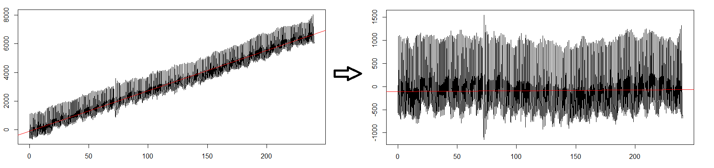

```{r setup, include=FALSE}
```

## PPG Model 2

This is a ReadMe for the photopletysmography (PPG) analysis published in []. It is supposed to both provide an overview of the workings of the code, any issues we encountered and some further explanations that did not make it into the paper. The basic assumption is that the signal is decaying towards a baseline and that the peaks can be modelled more accurately/conistently *?* by discounting the decay element first. 

# Prerequisites
The script makes use of the following packages:  
- library(tidyverse) *does it? think these three were for the splines in model1...*                               
- library(TeachingDemos) *does it?*  
- library(splines2)  
- library(pracma)  
- library(SplinesUtils)    
- library(spectral)  
- library(DescTools) *does it?*  

# Installation
Please install by typing `devtools::install_github(“Algebreaker/PPG”)`.

# ISOFitting
This is the main script from which the other functions are called. First the working directory needs to be changed so the other functions can be called and the sampling rate need to be adjusted, i.e. `samplingRate <- 40`. The `beats_in` and `batch_number` parameters determine how many beats the parameters are estimated over and how many batches are generated for analysis and optimisation. The code uses a chi-square goodness of fit test to improve model fit and will do so by minimising chi-square over all the beats within a batch. The default values are 10 for both.
If you would like to select a specific subsection of your dataset rather than analyse all beats change the parameter `all_beats <- TRUE` to `FALSE`. *not sure where you then specify the subset though?*  
Then the path of the to-be-read-in files needs to specified. 


In the first instance we are trying to estimate the various detrending algorithms that are often applied to the raw data by the hardware: As a first step in the preprocessing pipeline the factor value is adjusted to reverse-engineer an assumed positive gradient at the tail-end of each beat. *We somehow need to make sure that this is not confused with the pressure wave decay?* The values are changed until they reach a plausible-looking threshold for each individual beat: 


The next step involves calculating and applying an offset such that the main trendline of the data is approximately horizontal:

Then the main fun starts!

We interpolate a cubic spline of the provided data points 
`sfunction <- splinefun(1:length(undetrended), undetrended, method = "natural")`
and take its first derivative
`deriv1 <- sfunction(seq(1, length(undetrended)), deriv = 1)`. *I can't remember why we use the "aspiecepoly" as well?*  
Then the maximum of the first derivative, called the W point(s) are found:  
`w <- find_w(d1p = deriv1Poly, deriv1 = deriv1, sp = splinePoly, sr = samplingRate)`
  
Beat segmentation is based on the correct identification of the W points.  
Next U, V and O are detected. *We should probably have a little figure like the one above earlier on?*
*Then I think there is the potentially unnecessary baseline correction?*  

In the next step each beat is modelled as a composition of three peaks (S, D and N) with parameters determining the amplitude, timing and width of each within the dataframe `beat`: `STime`, `SAmplitude` `SWidth` and so forth. *Given we call it R1 peak in the paper we probably need to rename the parameter?* Initial parameters are estimated using the excess of each beat which is what is left once the assumed decay (config rate?) towards a variable baseline is factored out:     
`excess[1] = data[1,2] - (baseline + config.rate*(yPrev-baseline))`

The width of each peak is initialised at 0.25 `par[4] <- 0.25`  


Then we start running the simplex...

# Contributing 
We would love to hear from people who would like to contribute or have ideas for developing out model further. While we do not aim to support it for future versions of R...
